# Mã nguồn Mermaid.js cho các sơ đồ hệ thống Kollab

Tài liệu này cung cấp toàn bộ mã nguồn biểu đồ dạng **Mermaid.js** để bạn có thể sao chép và dán trực tiếp vào [mermaid.live](https://mermaid.live) hoặc [mermaid.ai](https://mermaid.ai) để tạo ra các sơ đồ cho hệ thống Kollab (Agile/Scrum Project Management System).

---

## 1. Biểu đồ Use - Case Tổng quát (General Use-Case Diagram)

Biểu đồ này biểu diễn các tác nhân (Actor) chính trong hệ thống Kollab và các nhóm chức năng lớn mà họ có thể thực hiện.

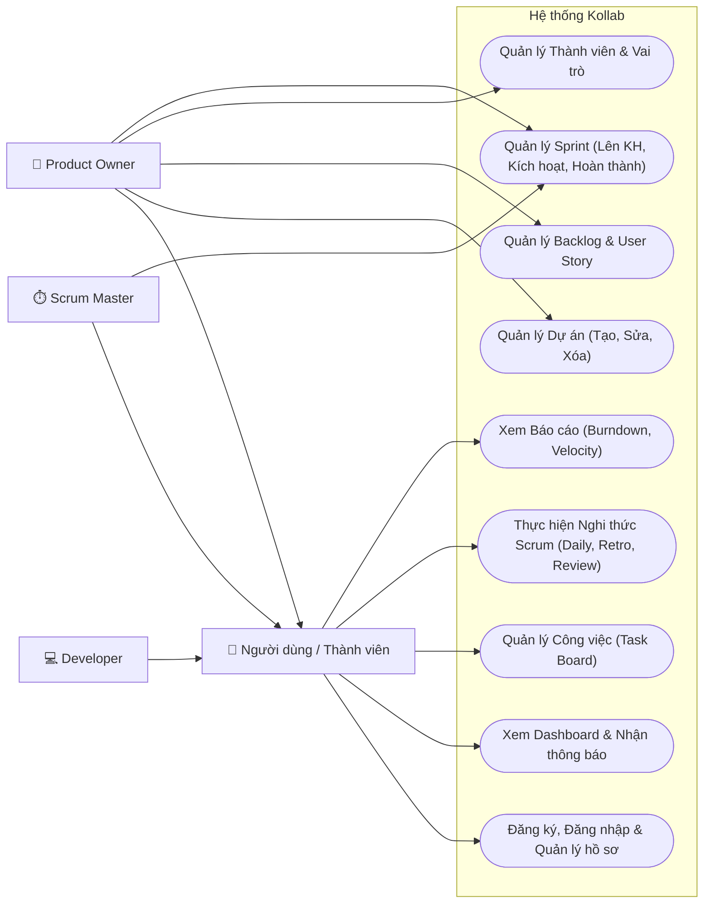

---

## 2. Biểu đồ Use - Case Chi tiết (Detailed Use-Case Diagram)

Biểu đồ này chia nhỏ các ca sử dụng lớn thành các ca sử dụng chi tiết hơn, mô tả mối quan hệ `<<include>>` và `<<extend>>`.

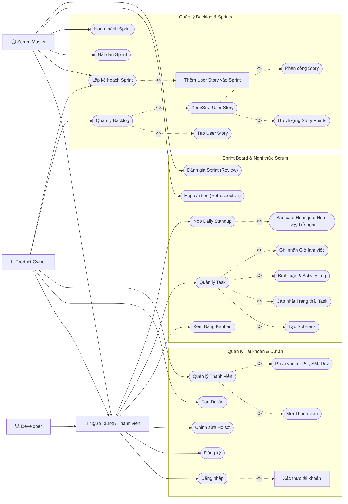

---

## 3. Biểu đồ Cơ sở Dữ liệu (Entity Relationship Diagram - ERD)

Dựa trên cấu trúc bảng thực tế từ file `supabase_schema.sql` và `supabase_schema_update.sql`.

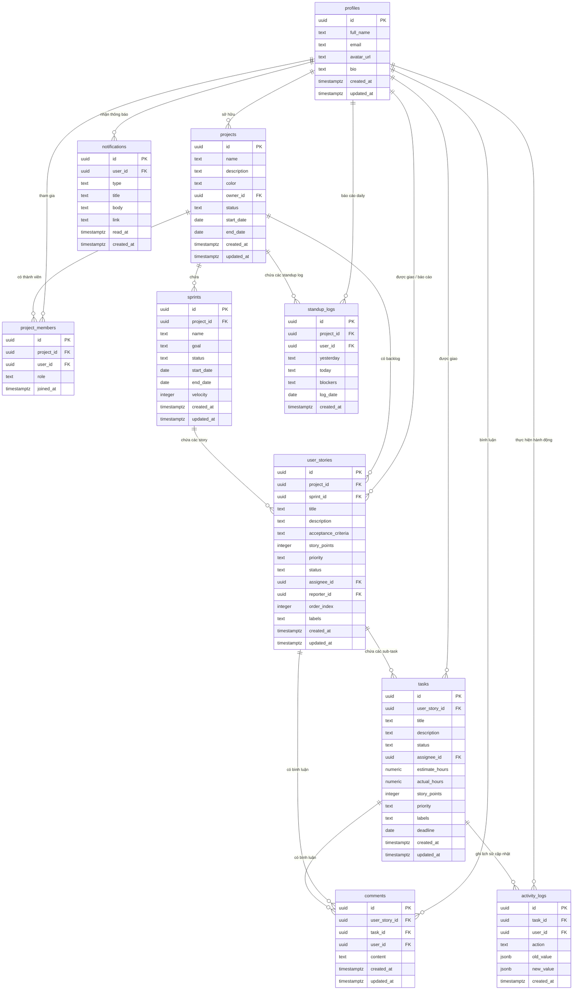

---

## 4. Class Diagram (Biểu đồ Lớp)

Biểu diễn kiến trúc phía Front-end của Kollab (React Typescript) gồm các Entity Types, các Hooks xử lý logic nghiệp vụ và các Zustand State Stores.

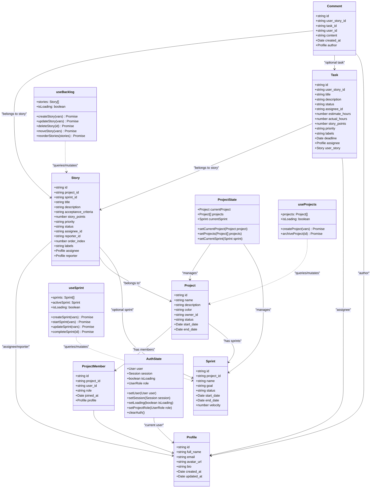

---

## 5. Biểu đồ Tuần tự cho 10 chức năng của Kollab (Sequence Diagrams)

### Chức năng 1: Đăng nhập & Đăng ký (Authentication)
Mô tả quy trình đăng ký tài khoản mới và đăng nhập vào hệ thống Kollab.

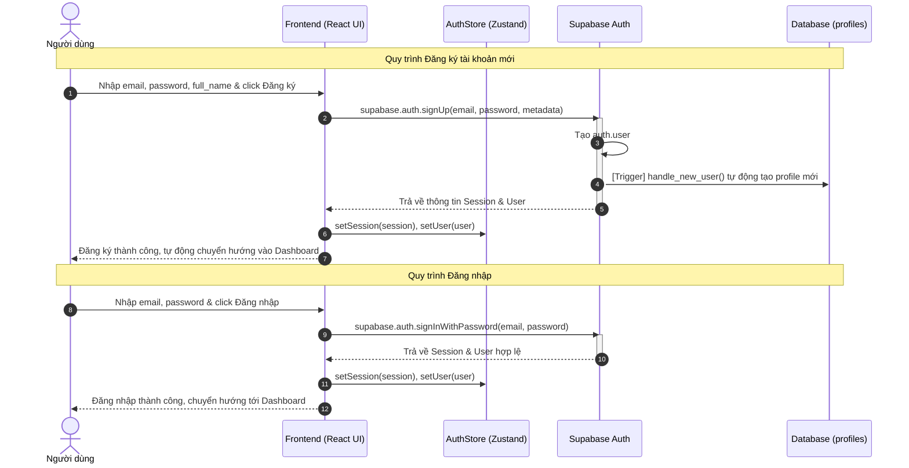

---

### Chức năng 2: Quản lý Dự án (Project Management)
Mô tả quy trình Product Owner khởi tạo một dự án Agile mới trên hệ thống.

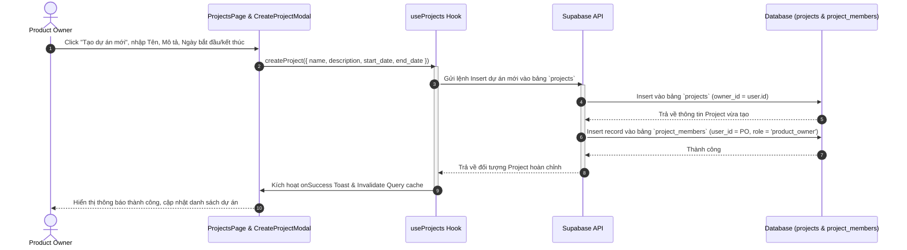

---

### Chức năng 3: Quản lý Thành viên (Member Management)
Mô tả quy trình thêm thành viên mới vào dự án và gán vai trò Scrum tương ứng.

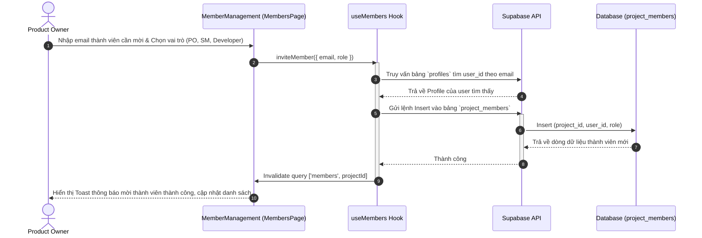

---

### Chức năng 4: Quản lý Backlog & User Story (Backlog Management)
Mô tả quy trình Product Owner quản lý danh sách sản phẩm (Product Backlog), tạo các User Story.

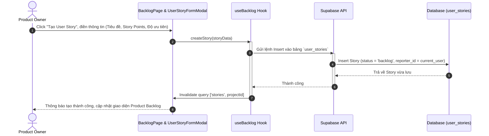

---

### Chức năng 5: Lập kế hoạch & Bắt đầu Sprint (Sprint Planning & Activation)
Mô tả quy trình Scrum Master và Product Owner lập kế hoạch cho Sprint mới và kích hoạt Sprint.

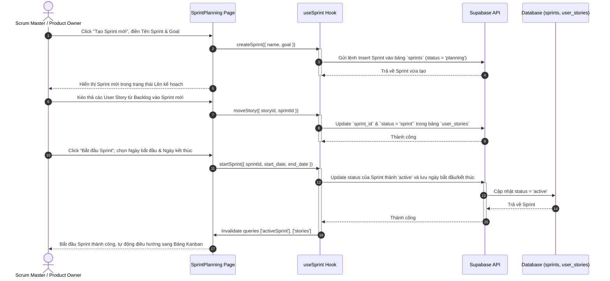

---

### Chức năng 6: Bảng Kanban & Cập nhật Task (Sprint Board & Task Management)
Mô tả quy trình các Developer quản lý các công việc con (Sub-tasks) trên bảng Kanban, cập nhật trạng thái bằng kéo thả, bình luận, và hệ thống sẽ tự động ghi vết (Activity Log) cũng như gửi thông báo (Notification).

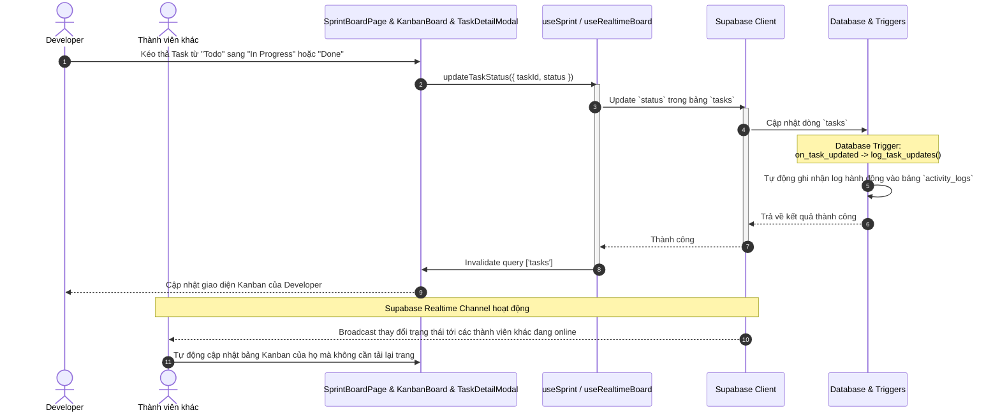

---

### Chức năng 7: Daily Standup (Daily Standup Ceremony)
Mô tả quy trình gửi báo cáo họp đứng hàng ngày của thành viên dự án.

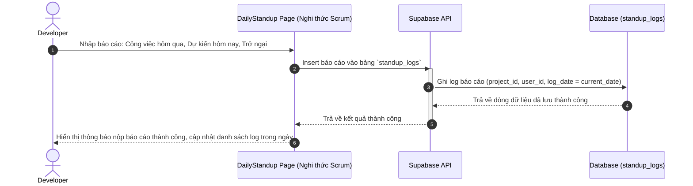

---

### Chức năng 8: Đánh giá Sprint & Đóng Sprint (Sprint Review & Closure)
Mô tả quy trình Scrum Master / Product Owner xem đánh giá Sprint, xử lý các story chưa hoàn thành và chính thức hoàn thành Sprint hiện tại.

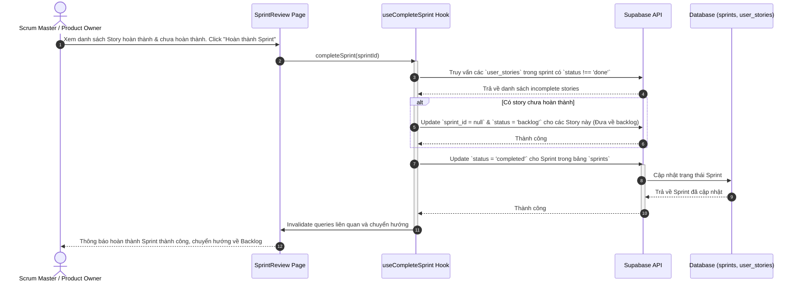

---

### Chức năng 9: Họp Cải tiến Sprint (Sprint Retrospective)
Mô tả quy trình cả đội thực hiện nghi thức họp cải tiến Sprint. Chức năng này được lưu trữ và đồng bộ hóa qua LocalStorage theo đặc tả thực tế của Kollab.

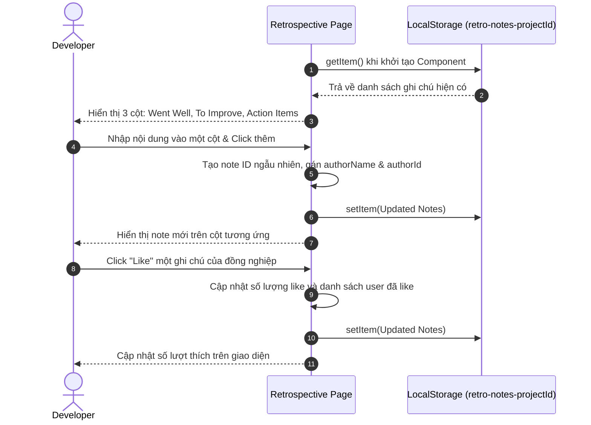

---

### Chức năng 10: Xem Báo cáo & Biểu đồ (Reports & Analytics)
Mô tả quy trình lấy dữ liệu lịch sử để vẽ biểu đồ Burndown Chart và Velocity Chart của dự án.

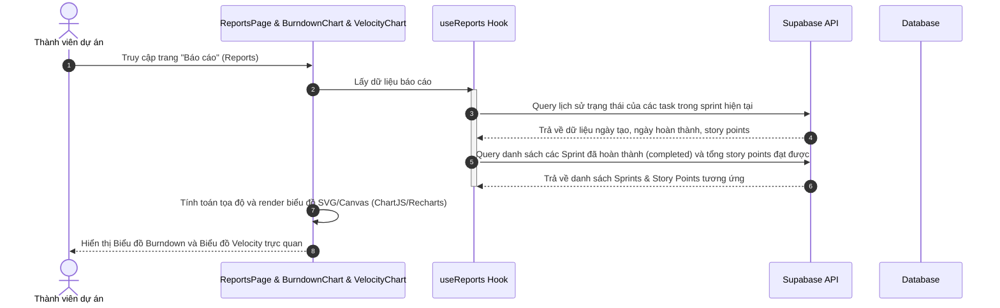
